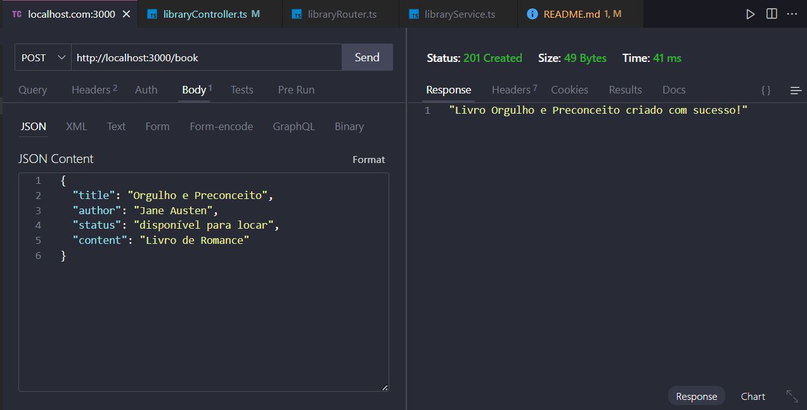
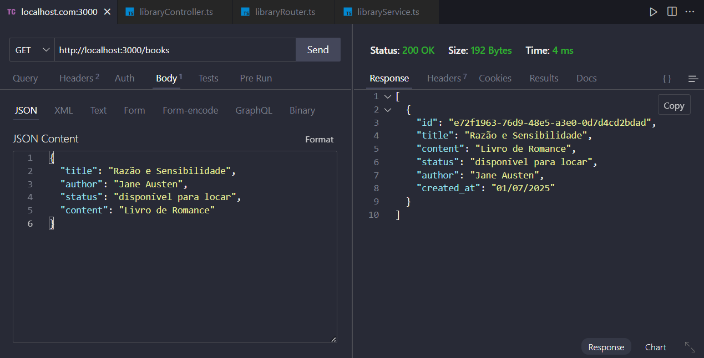
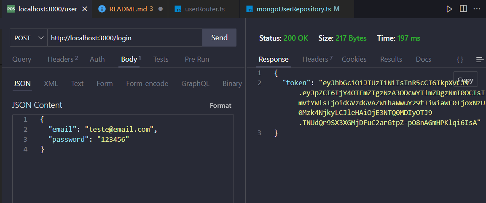
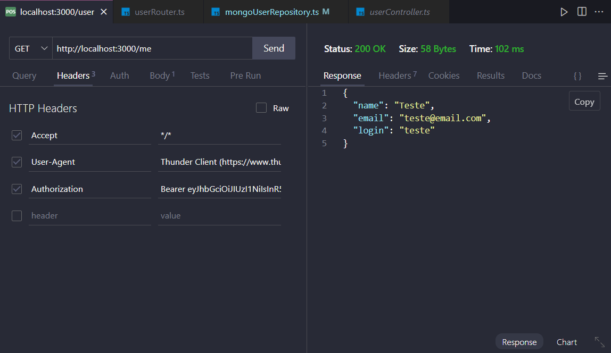

# Projeto de API com Clean Architecture usando TypeScript e Express

Este projeto é uma API simples de biblioteca, implementada com Clean Architecture, utilizando TypeScript e Express. A API permite criar e listar livros.

## Tecnologias utilizadas

- Node.js
- Express.js
- Nodemon
- Cors
- Supertest
- Jest
- MongoDB
- Mongoose
- TypeScript
- Bcrypt
- JSON Web Token (JWT)

## Instalação

Clone este repositório:

``git clone + endereço do repositório``

Entre na pasta do projeto:

``cd nome-da-pasta``

Instale as dependências:

``npm install``

Inicie o servidor:

``npm run dev``

Obs: Certifique-se de ter o Node.js e o npm instalados em sua máquina. Além disso, é necessário ter o TypeScript instalado globalmente. Você pode instalar o TypeScript com o seguinte comando:

``npm install -g typescript``

## Testes

Para verificar a cobertura de testes, você pode usar o seguinte comando:

``npm run test:coverage``

Para rodar os testes, utilize:

``npm run test``

## Banco de dados

Para este projeto, utilizamos o MongoDB como banco de dados. Certifique-se de ter o MongoDB instalado e rodando em sua máquina. Você pode usar o MongoDB Atlas para uma solução em nuvem ou instalar localmente.

Instale as dependências do MongoDB e dotenv:
``npm i mongoose`` e
``npm i dotenv``

Certifique-se de criar um arquivo `.env` na raiz do projeto com a seguinte variável:

```
MONGODB_URI=chave-criada-durante-a-criação-do-banco-no-MongoAtlas
```

## Estrutura do projeto

A estrutura do projeto segue os princípios da Clean Architecture, separando as responsabilidades em camadas distintas:

```
src/core/
  core/entities/
  core/repositories/
src/infra/
  infra/database/
  infra/server/
  infra/storage/
src/controllers/
src/factories/
src/routes/
src/services/
src/tests/
  tests/integration/
  tests/unit/
```

## Rotas

Nessa API, temos as seguintes rotas para gerenciar livros:

- **GET /**: Retorna uma mensagem de boas-vindas.
- **GET /books**: Retorna todos os livros.
- **POST /book**: Cria um novo livro.
- **GET /book/:id**: Retorna um livro específico pelo ID.
- **PATCH /book/:id**: Atualiza um livro específico pelo ID.
- **DELETE /book/:id**: Deleta um livro específico pelo ID.

Em relação aos usuários, temos as seguintes rotas:

- **GET /welcomeUser**: Retorna uma mensagem de boas-vindas.
- **GET /users**: Retorna todos os usuários.
- **POST /user**: Cria um novo usuário.
- **GET /user/:id**: Retorna um usuário específico pelo ID.
- **POST /login**: Faz login de um usuário.
- **GET /me**: Retorna as informações do usuário autenticado (necessita de token JWT).
- **DELETE /user/:id**: Deleta um usuário específico pelo ID.

*Importante: o id do livro é gerado automaticamente pelo MongoDB, então não é necessário enviá-lo ao criar um livro. Você pode obter o ID do livro após a criação e usá-lo para as operações de leitura, atualização e exclusão.*

## Exemplo de uso

## Para criar um livro, você pode enviar uma requisição POST para a rota `/book` com o seguinte corpo

```json
{
  "title": "O Senhor dos Anéis",
  "author": "J.R.R. Tolkien",
  "content": "Uma história épica de fantasia.",
  "status": "disponível"
}
```



O resultado será uma mensagem de sucesso indicando que o livro foi criado com sucesso.

## Para listar todos os livros, você pode enviar uma requisição GET para a rota `/books`. O resultado será um array com todos os livros cadastrados



## Para deletar um livro, você pode enviar uma requisição DELETE para a rota `/book/:id`, onde `:id` é o ID do livro que você deseja deletar

```json
{
  "message": "Livro com ID 1 deletado com sucesso!",
}
```

## Para atualizar um livro, você pode enviar uma requisição PATCH para a rota `/book/:id` com o seguinte corpo - ou outro corpo que desejar

```json
{
  "title": "O Senhor dos Anéis - Edição Atualizada",
}
```

## ROTA POST /user - Usada para criar um usuário

```json
{
  "name": "Ângela Carvalho",
  "login": "angela123",
  "email": "angela@example.com",
  "password": "senha123"
}
```

## ROTA POST /login - Usada para fazer login

```json
{
  "login": "angela123",
  "email": "angela@example.com"
}
```



Deve retornar o token JWT. Importante salientar que o token expira em 1 hora. E que para seu token ser validado, o usuário deve estar cadastrado no banco de dados.

## ROTA GET /me - Usada para retornar as informações do usuário autenticado. É necessário enviar o token JWT no cabeçalho da requisição



Nesse exemplo, o usuário fez login e recebeu um token JWT. Em seguida, ele usou esse token para acessar a rota `/me`, que retorna as informações do usuário autenticado.

## Próximos passos

- Aumentar a cobertura de testes para 100%.
- Implementar mais testes unitários.
- Adicionar imagens dos testes com Delete e Patch

Projeto desenvolvido por Ângela Carvalho
